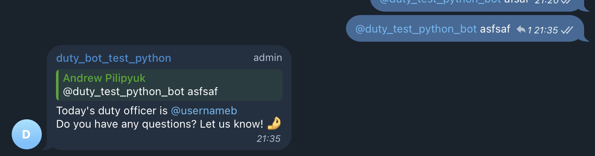

---
# Duty bot definition
This is the duty bot on python
He can reply on your message and tag today's duty engineer with tag him in answer



[media/demo.mov](https://github.com/user-attachments/assets/c2f9d71c-cc15-4986-97fc-85ca58934bc2)

---
# Installation guide

- first what you need is create telegram bot by the instruction
    like this one
    https://sendpulse.com/knowledge-base/chatbot/telegram/create-telegram-chatbot
    and get the bot token and name

- If you need to change message text fo reply you need to change them on this file
    https://github.com/pilipyukaaa/duty/blob/main/duty_bot/templates/messages.py
    ```python
    def reply_message():
    message = generate_reply_message(f"""
    Today's duty officer is {get_duty()}
    Do you have any questions? Let us know! 🤌
    """)
    return message


    def reply_message_weekend():
        message = generate_reply_message(f"""
            Today is a weekend, and no duty officers are available. We can assist on weekdays
            from 10:00 to 19:00 🌚
        """)
        return message
    
    
    def reply_message_out_time():
        message = generate_reply_message(f"""
            Unfortunately, support is only available from 10:00 to 19:00 on weekdays.
            There's no one available to respond right now, but if your question is urgent,
            you can call +44444444444; maybe someone will pick up. 🌚
        """)
        return message
    ```
- second you need to build an image from this repository

    ```Bash
    docker build -t duty_bot:0.0.1 . 
    ```
    you can replace image tag for push image into your private registry

- third you need to made bot is admin on your telegram chat

- fourth you need to install helm chart on your kubernetes cluster
    ```Bash
    cd deploy/helm
    helm install duty-bot -f values.yaml -n default . 
    ```
---
# Helm chart definition

You can upload duty calendar and team map into values.yaml
```yaml
  extraConfigs:
    duty_configmap.py: |
      """Hour when bot should start answer"""
      work_start_hour = 00

      """Hour when bot should stop answer"""
      work_stop_hour = 23

      """Number of active days on week(5 days from monday to friday for example)"""
      active_days = 7

      """Team members on format (id, name and secind name, email, mobile number, telegram username)"""
      team = [
        ("1", "Alice Show", "ashow@example.com", "+33333333333", "@usernamea"),
        ("2", "Mike Cooper", "mcooper@example.com", "+44444444444", "@usernameb"),
              ]
      
      """Calendar data on format (duty_id, date)"""
      duty_calendar = [
                      (1, '2024-07-07'),
                      (2, '2024-07-08'),
                      (1, '2024-07-09'),
                      ]
```
